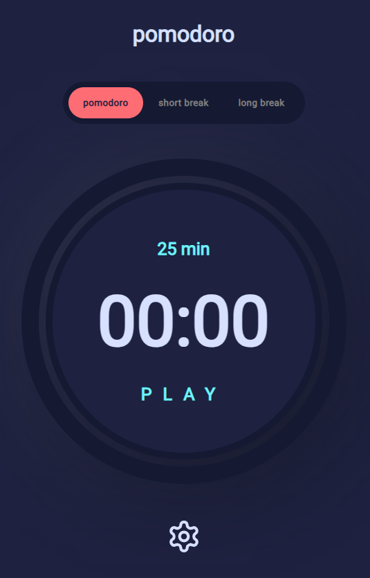
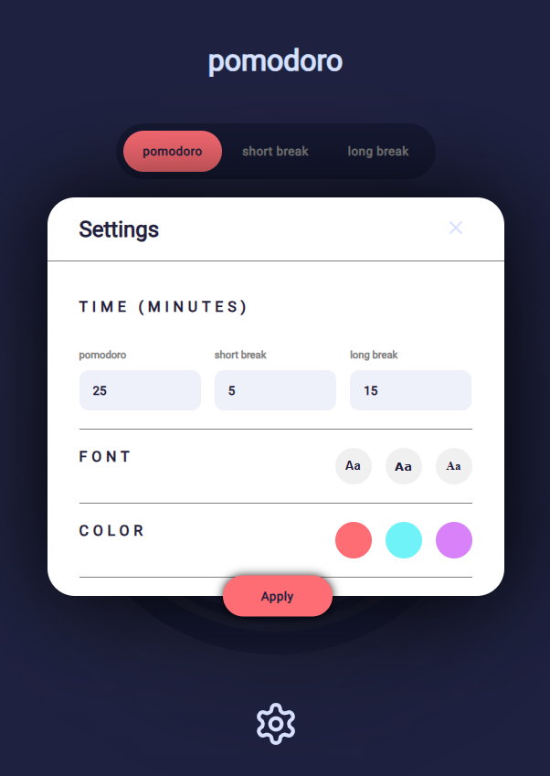

# Pomodoro App

This is a simple pomodoro app built with React and Vite.

[Click here for view the app]("http://pomodoro-app-1.surge.sh/")

-   [Pomodoro App](#pomodoro-app)

    -   [Description](#description)
    -   [Getting Started](#getting-started)
    -   [Screenshots](#screenshots)

## Features

-   Lets you set a timer for `x` minutes and take a `y` minute break.
-   You can set the timer to loop indefinitely or stop after `n` loops.

## Tech used

-   React
-   Vite
-   Typescript

## Installation

1. Clone the repository:

```shell
git clone git@github.com:rivasjoaquin02/pomodoro-app.git
```

1. Install the dependencies:

```shell
npm install
```

1. Start the development server:

```shell
npm run dev
```

## Screenshots

<section style="display: flex; gap: 5px; flex-wrap: wrap" >
  
  
</section>

## Contributing

Contributions are always welcome! If you have any suggestions or find any bugs, please open an issue or a pull request.

## License

This project is licensed under the MIT License - see the LICENSE file for details.
